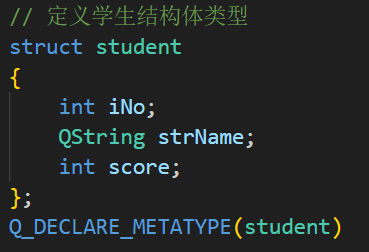

# QVariant类

Variant 英/ˈveəriənt/
n.变种，变形；（单词拼写或读音的）变异，变体
adj.不同的，变体的，变种的

详情参考:material_lib\2008 QVariant类应用.pdf

## 语法注释

### Q_DECLARE_METATYPE(......)

- 在Qt中，`Q_DECLARE_METATYPE`宏的目的是通知Qt元对象系统（Meta-Object System）关于自定义数据类型的信息。它告诉Qt该类型可用于信号和槽的参数、QVariant的参数以及其他元对象系统的相关功能。

- 为了能够在信号和槽的参数中使用自定义数据类型，以及利用Qt提供的许多元对象功能，比如在模型/视图编程中，或者使用`QVariant`进行类型安全的值传递，Qt需要知道这些类型的元信息。而`Q_DECLARE_METATYPE`宏就是用来提供这些元信息的。

- 所以，当你想要在Qt应用程序中使用自定义的数据类型时，你需要调用`Q_DECLARE_METATYPE`宏来为该类型注册元信息，这样Qt就能够正确地处理该类型，使其可以与Qt的元对象系统进行交互。

- 在`QVariant`转换中，`Q_DECLARE_METATYPE`宏的作用是告诉Qt，该类型可以使用`QVariant`进行转换。如果没有这个宏，那么`QVariant`将无法将自定义类型转换为`QVariant`，或者将`QVariant`转换为自定义类型。
