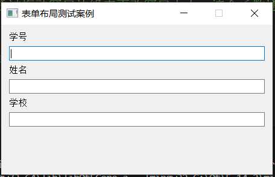

# QFormLayout 表单布局

## 语法解释

### qLayout->setRowWrapPolicy(QFormLayout::WrapAllRows)

- WrapAllRows将标签显示在单行编辑框上面

### qLayout->setRowWrapPolicy(QFormLayout::WrapLongRows)

- WrapAllRows将标签显示在单行编辑框同一行。

