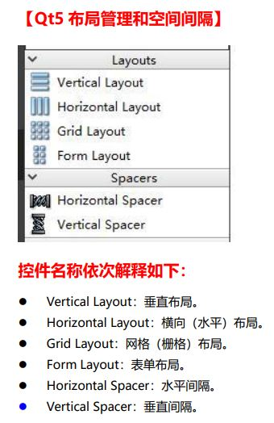
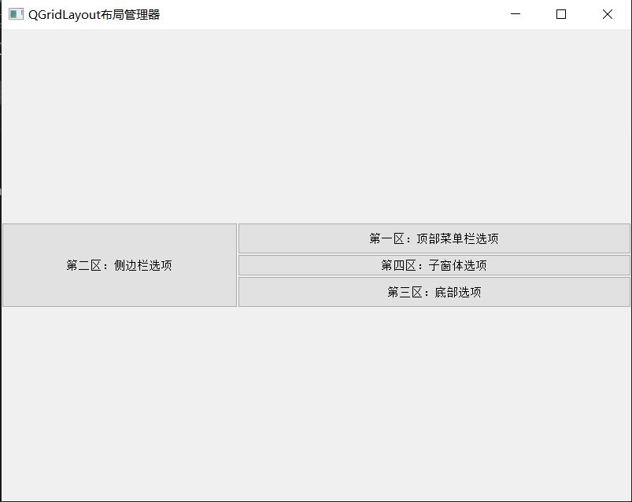
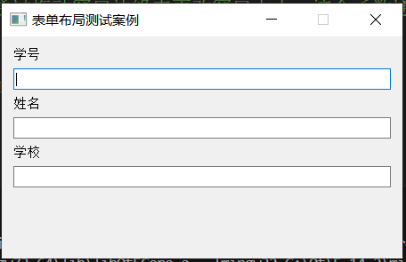
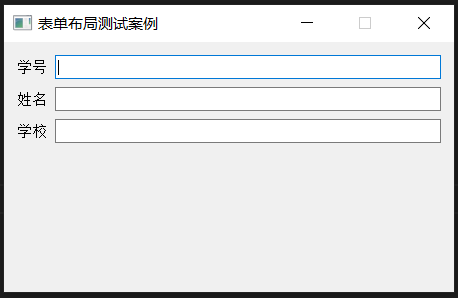
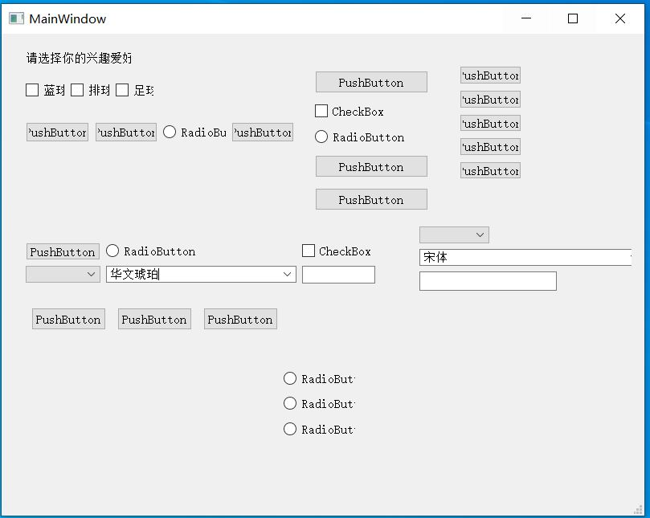

# Qt5 布局管理和空间间隔

## 01_GridlayoutsPross

QGridLayout 获取对其可用的空间（通过其父布局或通过 parentWidget()），将其划分为行和列，并将其管理的每个小部件放入正确的单元格中。
每列/行都有一个最小宽度/最小高度和一个拉伸因子。
列和行的宽度或高度不同。如果希望两列具有相同的宽度，必须将它们的最小宽度和拉伸因子设置为相同。
QGridLayout 还包括两个边距宽度：内容边距和间距。内容边距是沿 QGridLayout 的四个边的每个保留空间的宽度。间距是相邻框之间自动分配的间距的宽度。
默认内容边距值由样式提供。Qt 样式指定的默认值对于子窗口小部件是 9，对于窗口是 11。间距默认与顶级布局的边距宽度相同，或与父布局相同。

## 02_formlayoutsprossu

表单布局。是一个方便的布局类，它以两列形式布置其子项。左列由标签组成，右列由“字段”小部件（行编辑器、微调框等）组成。
两列布局时使用 QFormLayout 比 QGridLayout 更加方便。

## 03_layoutsspacerstest

