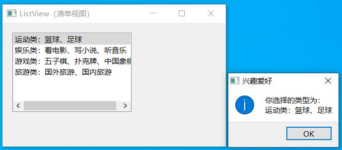
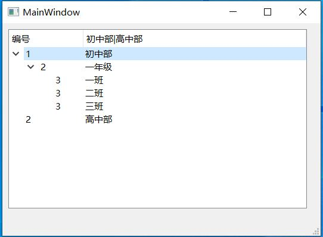
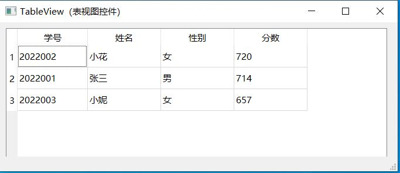
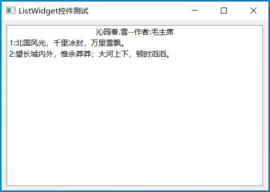
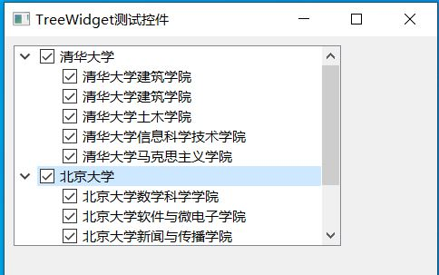
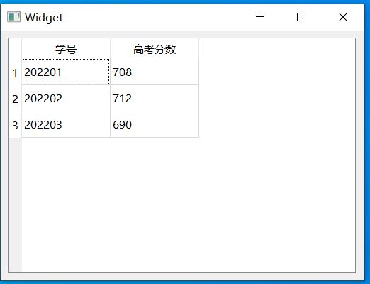

# QT开发控件

## 1.Qt 项目视图 Item Views

List View：清单视图
Tree View：树视图
Table View：表视图
Column View：列视图
Undo View：撤销命令视图

### 01_QtListViewPross

List View：清单视图

### 02_QTreeViewPross

Tree View：树视图

### 03_QTableViewPross

Table View：表视图

## 2.Qt 项目部件 Item Widgets

List Widget：清单控件
Tree Widget：树形控件
Table Widget：表控件

### 04_QListWidgetsPross

List Widget：清单控件

### 05_QTreeWidgetPross

Tree Widget：树形控件

### 06_QTableWidgetPross

Table Widget：表控件

