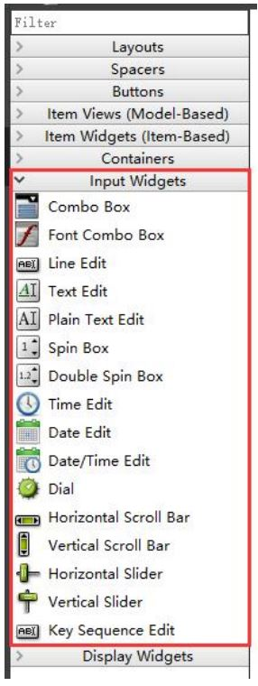
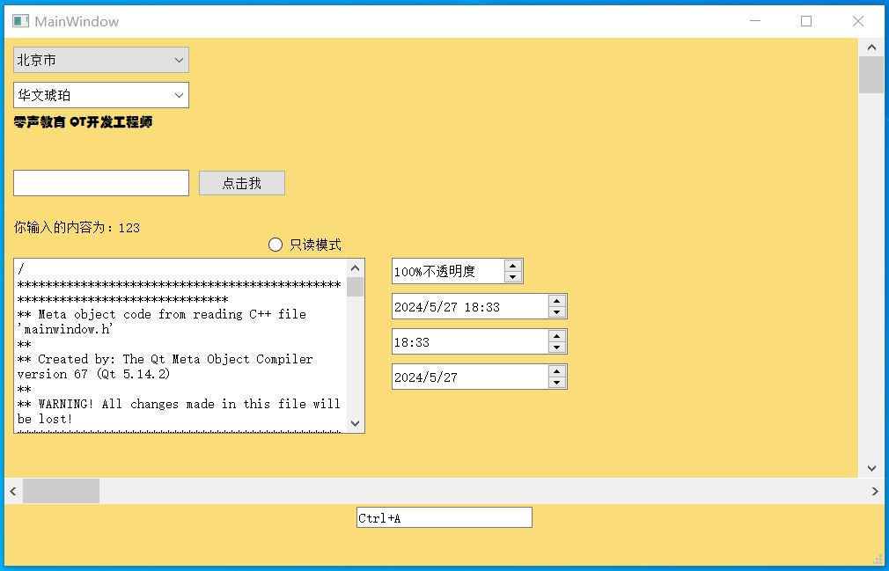
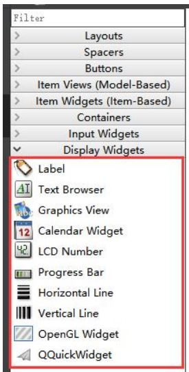
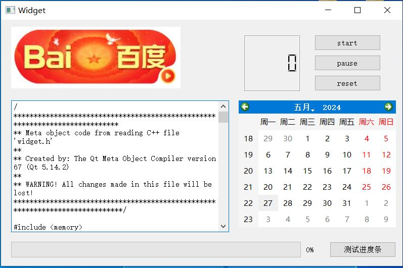

# Input Widgets & Display Widgets

## Input Widgets

Qt 输入组控件 Input Widgets

编辑组合框
字体组合框
行编辑框
文本编辑框
多行文本编辑器
整数旋转框
小数旋转框
时间编辑
日期编辑
日期时间编辑
表盘控件
水平和垂直滚动条
水平和垂直滑动条
快捷键输入控件

### 01_QInputWidgetProsst

## Display Widgets

Qt 显示组控件 Display Widgets

Label：标签*
Text Browser：文本浏览器*
Graphics View：图形视图框架
Calendar Widget：日历控件
LCD Number：液晶字体数字控件*
Progress Bar：进度条*
Horizontal Line/Vertical Line：水平线/垂直线
OpenGL Widget：OpenGL 图形渲染控件
QQuickWidget：QML 嵌入控

### 02_QtDisplayWidgetProssss

