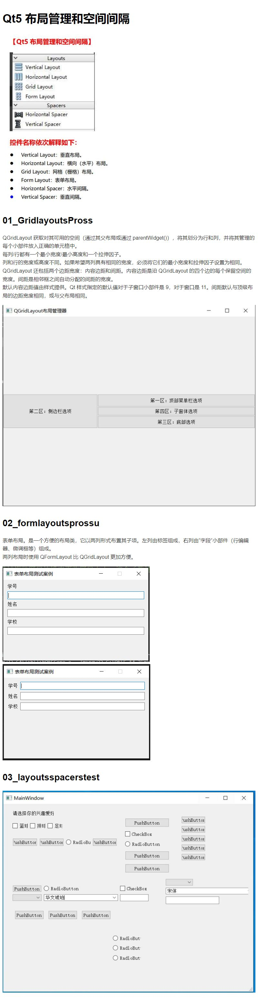
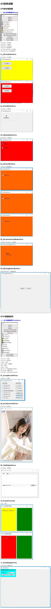
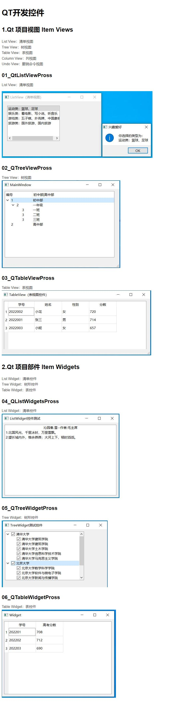
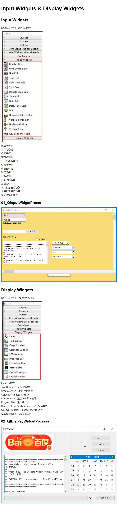

# Qt 开发基础体系(常用开发控件详解)

## 6-1

## 6-2_6-3

## 6-4

## 6-5

## Qt中QMainWindow、QWidget、QDialog的区别

- QMainWindow是一个主窗口类，它是一个包含状态栏、主菜单等我们常用的工具的界面。
- QWidget是一个最基础的可视化界面，可以理解为最原始的一张白纸，我们需要向其添加一些控件和布局。
- QDialog是一个对话框，我们如果需要建立对话框类界面则需要选它，并且如果它后面还有窗口，那么后面窗口不可选择。
